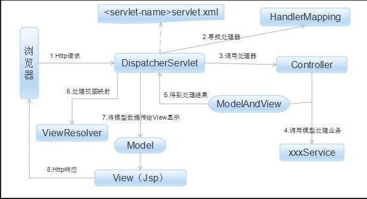
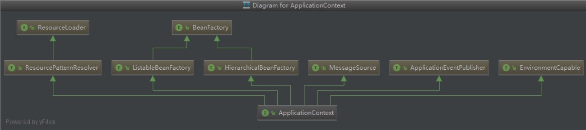

个人参考网上一些面试题，整理的部分Java知识点，难免存在遗漏或错误，欢迎指正交流。

主要包括内容有：

> - Java多线程、并发相关
> - Spring
> - MySQL（待完善）
> - JVM
> - Netty（待完善）
> - Redis（待完善）

## Java多线程、并发相关

**1、多个线程同时读写，读线程的数量远远大于写线程，你认为应该如何解决并发的问题？你会选择加什么样的锁？**

多个线程同时读写，也就是多个线程同时访问一个资源，读线程数量远大于写线程，这种情境下有以下几种方案：

1. 读写锁，读线程可以同时操作。
2. volatile，volatile保证了内存可见性，只要volatile资源更新不依赖其之前的状态，则volatile就是线程安全的，这种情况下性能比读写锁更好。
3. 原子操作类。

**2、JAVA的AQS是否了解，它是干嘛的？**

队列同步器AbstractQueuedSynchronizer（以下简称同步器），是用来构建锁或者其他同步组件的基础框架，它使用了一个int成员变量表示同步状态，通过内置的FIFO队列来完成资源获取线程的排队工作，并发包的作者（Doug Lea）期望它能够成为实现大部分同步需求的基础。

同步器的主要使用方式是继承，子类通过继承同步器并实现它的抽象方法来管理同步状态，在抽象方法的实现过程中免不了要对同步状态进行更改，这时就需要使用同步器提供的3个方法（getState()、setState(int newState)和compareAndSetState(int expect,int update)）来进行操作，因为它们能够保证状态的改变是安全的。子类推荐被定义为自定义同步组件的静态内部类，同步器自身没有实现任何同步接口，它仅仅是定义了若干同步状态获取和释放的方法来供自定义同步组件使用，同步器既可以支持独占式地获取同步状态，也可以支持共享式地获取同步状态，这样就可以方便实现不同类型的同步组件（ReentrantLock、ReentrantReadWriteLock和CountDownLatch等）。

同步器是实现锁（也可以是任意同步组件）的关键，在锁的实现中聚合同步器，利用同步器实现锁的语义。可以这样理解二者之间的关系：锁是面向使用者的，它定义了使用者与锁交互的接口（比如可以允许两个线程并行访问），隐藏了实现细节；同步器面向的是锁的实现者，它简化了锁的实现方式，屏蔽了同步状态管理、线程的排队、等待与唤醒等底层操作。锁和同步器很好地隔离了使用者和实现者所需关注的领域。

**3、除了synchronized关键字之外，你是怎么来保障线程安全的？**

除了使用synchronized关键之外，还可以使用Lock（包括读写锁）来保证线程安全，使用Lock更灵活。如果多线程访问的资源的更新不依赖其之前状态，则可以使用volatile，volatile相比Lock来说更加轻量级。

**4、什么时候需要加volatile关键字？它能保证线程安全吗？**

需要保证内存可见性，可以使用volatile关键字，volatile保证内存可见性，但是不保证原子性，所以不保证线程安全。

**5、线程池内的线程如果全部忙，提交⼀个新的任务，会发生什么？队列全部 塞满了之后，还是忙，再提交会发生什么？**

线程池线程都处于runable状态时，提交一个新任务，如果此时线程数未达到coreSize，则创建一个新的线程执行该任务；否则会将该任务添加到队列中。

如果队列塞满了，线程还是都处于runable状态，如果此时线程数未到达maxSize，则创建一个新的线程执行该任务，否则该任务将被拒绝，并调用相应的饱和策略来处理（RejectedExecutionHandler.rejectedExecution()方法，线程池默认的饱和策略是AbortPolicy，也就是抛异常）。

**6、Tomcat本身的参数你⼀般会怎么调整？**

Tomcat本身的参数主要是在conf/server.xml和bin/catalina.sh中进行配置，server.xml中可配置port、protocol、connectionTimeout、maxThreads、minSpareThreads等信息，catalina.sh可配置JVM参数信息。

内存优化调整在bin/catalina.sh进行配置，一般是配置server模式，-xmx/-xms等参数。
连接数优化一般是配置maxThreads和minSpareThreads等参数，当Tomcat业务线程是IO密集型任务的话，可适当增大maxThreads值；如果是CPU密集型的话，可适当减小maxThreads值。

**7、 synchronized关键字锁住的是什么东⻄？在字节码中是怎么表示的？在内存中的对象上表现为什么？**

synchronized关键字锁住的是与对象关联的monitor，JVM基于进入和退出monitor对象来实现方法同步和代码块的同步。 在字节码中是使用monitorenter和monitorexit执行实现的。任何对象都有一个monitor与之关联，当且一个monitor被持有后，它将处于锁定状态。线程执行到monitorenter指令时，将会尝试获取对象所对应的monitor的所有权，即尝试获得对象的锁。

synchronized用的锁是存在Java对象头里的。如果对象是数组类型，则虚拟机用3个字宽（Word）存储对象头，如果对象是非数组类型，则用2字宽存储对象头。

锁的类型包括4种：在Java SE 1.6中，锁一共有4种状态，级别从低到高依次是：无锁状态、偏向锁状态、轻量级锁状态和重量级锁状态，这几个状态会随着竞争情况逐渐升级。锁可以升级但不能降级，意味着偏向锁升级成轻量级锁后不能降级成偏向锁。这种锁升级却不能降级的策略，目的是为了提高获得锁和释放锁的效率。

**8、wait/notify/notifyAll方法需不需要被包含在synchronized块中？这是为什 么？**

需要。这三个方法，都是Java语言提供的实现线程间阻塞(Blocking)和控制进程内调度(inter-process communication)的底层机制。

1.  正如Java内任何对象都能成为锁(Lock)一样，任何对象也都能成为条件队列(Condition queue)
2.  一个对象的固有锁和它的固有条件队列是相关的，为了调用对象X内条件队列的方法，你必须获得对象X的锁。这是因为等待状态条件的机制和保证状态连续性的机制是紧密的结合在一起的。

也就是说，这3个方法的使用必须处于synchronized块中，这是为了多线程安全。更多资料参考：[https://www.cnblogs.com/techyc/p/3272321.html](https://www.cnblogs.com/techyc/p/3272321.html)

**9、ExecutorService你⼀般是怎么用的？是每个service放一个还是一个项目里面放一个？有什么好处？**

ExecutorService是Executor直接的扩展接口，也是最常用的线程池接口。一般使用可以按照不同任务类型划分为不同的线程池，如果有隔离的需求，也可借助不同的线程池来实现。

Java通过Executors提供四种线程池，分别为：
- newCachedThreadPool创建一个可缓存线程池，如果线程池长度超过处理需要，可灵活回收空闲线程，若无可回收，则新建线程。
- newFixedThreadPool 创建一个定长线程池，可控制线程最大并发数，超出的线程会在队列中等待。
- newScheduledThreadPool 创建一个定长线程池，支持定时及周期性任务执行。
- newSingleThreadExecutor 创建一个单线程化的线程池，它只会用唯一的工作线程来执行任务，保证所有任务按照指定顺序(FIFO, LIFO, 优先级)执行。

## Spring

**1、你有没有⽤过Spring的AOP? 是用来干嘛的? 大概会怎么使用？**

AOP面向切面编程，可以说是OOP（Object Oriented Programming，面向对象编程）的补充和完善。OOP引入封装、集成、多态，建立了一种对象层次结构，模拟公共行为的一个集合。OOP允许开发者定义纵向的关系，但并不适合定义横向的关系，例如日志功能。日志代码往往横向地散布在所有对象层次中，而与它对应的对象的核心功能毫无关系对于其他类型的代码，如安全性、异常处理和透明的持续性也都是如此，这种散布在各处的无关的代码被称为横切（cross cutting），在OOP设计中，它导致了大量代码的重复，而不利于各个模块的重用。

AOP技术恰恰相反，它利用一种称为"横切"的技术，剖解开封装的对象内部，并将那些影响了多个类的公共行为封装到一个可重用模块，并将其命名为"Aspect"，即切面。所谓"切面"，简单说就是那些与业务无关，却为业务模块所共同调用的逻辑或责任封装起来，便于减少系统的重复代码，降低模块之间的耦合度，并有利于未来的可操作性和可维护性。

使用"横切"技术，AOP把软件系统分为两个部分：核心关注点和横切关注点。业务处理的主要流程是核心关注点，与之关系不大的部分是横切关注点。横切关注点的一个特点是，他们经常发生在核心关注点的多处，而各处基本相似，比如**权限认证、日志、事务**。AOP的作用在于分离系统中的各种关注点，将核心关注点和横切关注点分离开来。	

**2、如果⼀个接⼝有2个不同的实现, 那么怎么来Autowire一个指定的实现？**

使用`@Qualifiter`指定某个具体实现。

**3、Spring的声明式事务 @Transaction注解⼀般写在什么位置? 抛出了异常会自动回滚吗？有没有办法控制不触发回滚?**

@Transactional注解可以标注在类和方法上，也可以标注在定义的接口和接口方法上。如果我们在接口上标注@Transactional注解，会留下这样的隐患：因为注解不能被继承，所以业务接口中标注的@Transactional注解不会被业务实现类继承。所以可能会出现不启动事务的情况。所以，Spring建议我们将@Transaction注解在实现类上。在方法上的@Transactional注解会覆盖掉类上的@Transactional。

@Transactional在方法内抛出异常，@Transactional机制捕获到该异常后会进行事务的回滚。如果想不触发回滚，则在内部捕获异常，不要外抛。

**4、如果想在某个Bean⽣成并装配完毕后执行自己的逻辑，可以什么方式实现？**

init方法即可。

**5、SpringBoot没有放到web容器为什么能跑HTTP服务？**

SpringBoot内嵌的tomcat。

**6、SpringBoot中如果你想使用自定义的配置⽂件而不仅仅是 application.properties，应该怎么弄？**

`@ImportResource。`

**7、SpringMVC中RequestMapping可以指定GET, POST方法么？怎么指定？**

`@GetMapping、@PostMapping`

**8、SpringMVC如果希望把输出的Object(例如XXResult或者XXResponse)这 种包装为JSON输出, 应该怎么处理?**

使用@ReponseBody配置在Controller方法上，或者使用@RestController。

**9、怎样拦截SpringMVC的异常，然后做自定义的处理，比如打日志或者包装成JSON**

使用AOP拦截Controller方法，在抛出异常时进行处理，比如打日志或包装JSON。

```Java
@Aspect
@Component
@Order(1)
public class ResultAspect {
    private static final Logger logger = LogManager.getLogger();
 
    @Around("execution(public * com.demo.luo.controller.*.*(..))")
    public Object aroundMethod(ProceedingJoinPoint joinPoint) throws Throwable {
        try {
            Object result = joinPoint.proceed();
            return ResultUtil.success(result);
        } catch (Exception e) {
            logger.error("invoke error: {} {}, e={}", joinPoint.getSignature(), joinPoint.getArgs(), e);
 
            // 返回异常信息
            return ResultUtil.error(e.getMessage());
        }
    }
 
}	
```

**10、spring框架中需要引用哪些jar包，以及这些jar包的用途**

```
Spring框架中常用jar包如下：
spring-core：核心jar包，核心组件，他其中包含了很多的关键类。
spring-beans：IoC相关jar包。
spring-aop：aop相关包。
spirng-context：数据的生存环境。
spring-web、spirng-mvc：SpringMVC相关数据。
spring-jdbc：jdbc相关。
```

**11、SpringMVC原理**

SpringMVC是一款优秀的MVC框架，MVC（modal、view、controller）分别是模型、视图、控制器，SpringMVC框架是围绕一个DispatcherServlet来设计的，这个DispatcherServlet就是一个我们很熟悉的Servlet，当然这个Servlet，这个Servlet会把请求分发给各个处理器，并支持可配置的处理器映射、视图渲染、本地化、时区与主题渲染等，甚至还能支持文件上传等功能。原理如下图所示：



**12、springMVC注解的意思**

[https://www.cnblogs.com/yjq520/p/6734422.html](https://www.cnblogs.com/yjq520/p/6734422.html)

**13、spring中beanFactory和ApplicationContext的联系和区别**

下面一张图最能说明二者之间的关系：



二者都是IoC容器，beanFactory是基本的IoC容器，ApplicationContext除了拥有beanFactory全部功能外，提供了更多面向应用的功能，它提供了国际化支持和框架事件体系，更易于创建实际应用。一般称BeanFactory为IoC容器，而称 ApplicationContext为应用上下文，但有时为了行文方便，也将ApplicationContext称为Spring容器。

**14、spring注入的几种方式**

接口注入、构造方法注入、方法注入

**15、spring如何实现事务管理的**

在IoC容器统一管理@transactional包裹的代码，然后通过AOP生成对应的代理类，将代码包裹在try catch结构和事务操作中。

**16、springIOC和AOP的原理**

Spring是一个轻量级的Java开发框架，其提供的两大基础功能为IoC和AOP，其中IoC为依赖反转（Inversion of Control）。IOC容器的基本理念就是“为别人服务”，那为别人服务什么呢？其中最重要就是业务对象的构建管理和业务对象之间的依赖绑定。
- 业务对象的构建管理：业务场景中，无需关心业务对象如何创建、如何管理，在需要时只需获取即可。业务对象的构建管理交给IoC容器，避免这部分代码对业务逻辑的侵染。
- 业务对象间的依赖绑定：IoC容器需要先了解业务对象之间的依赖关系，这样依据之前业务对象的构建管理就可以对外提供IoC服务，保证每个业务对象在使用时处于就绪状态。

在进行 OOP 开发时，都是基于对组件（比如类）进行开发，然后对组件进行组合，OOP 最大问题就是无法解耦组件进行开发。AOP 为开发者提供一种进行横切关注点（比如日志关注点）分离并织入的机制，把横切关注点分离，然后通过某种技术织入到系统中，从而无耦合的完成了我们的功能。

IOC基于反射，AOP给予动态代理。在创建代理对象类bean实例后，会对bean实例进行初始化操作，在初始化流程中，如果有aspect增强，则会创建对应的代理类（JDK代理或者CGLIB代理），这块的逻辑在AbstractAutowireCapableBeanFactory.doCreateBean()方法中。

如果目标对象实现了接口，默认情况下会使用JDK的动态代理实现AOP；如果目标对象实现了接口，可以强制使用CGLIB实现AOP；如果目标对象没有实现接口，必须使用CGLIB库。Spring会自动在JDK动态代理和CGLIB之间转换。

Spring中CGLIB创建了一个代理类，该代理类是目标对象的子类，调用目标对象方法实质是调用代理类的方法，代理类方法中逻辑包括增强处理和调用目标对象对应方法的代码。

**17、hibernate中的1级和2级缓存的使用方式以及区别原理**

hibernate还没用过哈（难道和MyBatis中的缓存类似？）

**18、spring中循环注入的方式**

Spring中的循环依赖分为构造方法循环依赖、set方法循环依赖（单例模式、非单例模式）。Spring容器将每一个正在创建的Bean 标识符放在一个“当前创建Bean池”中，Bean标识符在创建过程中将一直保持在这个池中，因此如果在创建Bean过程中发现自己已经在“当前创建Bean池”里时将抛出BeanCurrentlyInCreationException异常表示循环依赖；而对于创建完毕的Bean将从“当前创建Bean池”中清除掉。

从Spring Bean创建流程来看，构造方法和非单例模式的set注入是无法完成循环注入的，因为在bean（链）创建过程中，发现自己还在“当前创建Bean池”，所以会报异常。单例模式的set注入是可以完成循环注入的，因为调用set方法实在bean创建OK后才进行的。

## JVM

**1、你知道哪些或者你们线上使用什么GC策略? 它有什么优势，适用于什么场景？**

系统大都是基于Tomcat的，jvm gc策略一般都是ParNew + CMS，ParNew是新生代多线程gc，CMS（Concurrent Mark Sweep）收集器是一种以获取最短回收停顿时间为目标的收集器。 目前很大一部分的Java应用集中在互联网站或者B/S系统的服务端上，这类应用尤其重视服务的响应速度，希望系统停顿时间最短，以给用户带来较好的体验。 CMS收集器就非常符合这类应用的需求。

**2、JAVA类加载器包括几种？它们之间的父子关系是怎么样的？双亲委派机制是什么意思？有什么好处？**

JVM的类加载的实现方式称为双亲委任模型，其流程是当收到一个类加载请求时，首先会交给父加载器完成，如果父加载器反馈自己无法加载时，子加载器才尝试自己完成加载，每一层次的类加载器都是如此。

从Java虚拟机的角度来讲，只存在两种不同的类加载器：一种是启动类加载器（Bootstrap ClassLoader），这个类加载器使用C++语言实现（Sun JVM就是由C++实现的），是虚拟机自身的一部分；另一种就是所有其他的类加载器，这些类加载器都由Java语言实现，独立于虚拟机外部，并且全都继承自抽象类java.lang.ClassLoader。

从Java程序员角度来看，类加载器还可以划分得更细致一些，绝大部分Java程序都会使用到以下3种系统提供的类加载器。
- 启动类加载器（Bootstrap ClassLoader）：前面已经介绍过，这个类将器负责将存放在＜JAVA_HOME＞\lib目录中的，或者被-Xbootclasspath参数所指定的路径中的，并且是虚拟机识别的（仅按照文件名识别，如rt.jar，名字不符合的类库即使放在lib目录中也不会被加载）类库加载到虚拟机内存中。
- 扩展类加载器（Extension ClassLoader）：这个加载器由sun.misc.Launcher$ExtClassLoader实现，它负责加载＜JAVA_HOME＞\lib\ext目录中的，或者被java.ext.dirs系统变量所指定的路径中的所有类库，开发者可以直接使用扩展类加载器。
- 应用程序类加载器（Application ClassLoader）：这个类加载器由sun.misc.Launcher $AppClassLoader实现。由于这个类加载器是ClassLoader中的getSystemClassLoader（）方法的返回值，所以一般也称它为系统类加载器。 它负责加载用户类路径（ClassPath）上所指定的类库，开发者可以直接使用这个类加载器，如果应用程序中没有自定义过自己的类加载器，一般情况下这个就是程序中默认的类加载器。

双亲委任模型，解决了类加载过程中的安全性问题，如果定义了一个Java基础类库中的一个类，使用双亲委任模型保证了Java基础类的加载由上层类加载器优先加载。

**3、如何自定义一个类加载器？你使⽤过哪些或者你在什么场景下需要一个自定义的类加载器吗？**

继承ClassLoader即可实现一个类加载器，双亲委任模型并不是一个强制性的模型，而是Java推荐开发者的类加载器实现方式，双亲委任模型实现逻辑在loadClass方法中。在基础类需要调用用户代码的API情况下需要自定义类加载器，一个典型的例子就是JNDI服务，JNDI现在已经是Java的标准服务，它的代码由启动类加载器去加载（在JDK1.3时放进去的rt.jar），但JNDI的目的就是对资源进行集中管理和查找，它需要调用由独立厂商实现并部署在应用程序的ClassPath下的JNDI接口提供者的代码，但启动类加载器不可能“认识”这些代码。

**4、堆内存设置的参数是什么？**

```
-Xmx：堆最大可用内存。
-Xms：堆初始内存，一般设置和-Xmx相同，避免每次GC完成后重新分配JVM堆。
-Xmn：年轻代大小
-Xss：线程堆栈大小
```

**5、Perm Space中保存什么数据? 会引起OutOfMemory吗？**

永久区，存放与类相关的信息，也有可能引起OutOfMemory的，如果加载的jar包过多，会导致内存不足引发OutOfMemory。

**6、做gc时，一个对象在内存各个Space中被移动的顺序是什么？**

一般的顺序是Edan -> Suriver -> 老年代，也有可能直接从Edan到老年代，老年代GC过程中，对象所在内存位置可能发生变化。

**7、你有没有遇到过OutOfMemory问题？你是怎么来处理这个问题的？处理过程中有哪些收获？**

引发OutOfMemory问题，一般是因为JVM配置不合理或者代码问题导致的。如果是永久代OutOfMemory，增大永久代空间即可；如果是heap OutOfMemory，首先排查JVM堆大小是否配置过小，过小时增加，然后检查程序，看是否有死循环或不必要地重复创建大量对象。找到原因后，修改程序和算法。

还有一种OutOfMemoryError：unable to create new native thread，这种情况可能是JVM占用了系统过多内存，导致系统可使用内存过小。Java一个Thread对应系统的一个native thread，在jdk1.4里头，默认的栈大小是256KB，但是在jdk1.5里头，默认的栈大小为1M每线程，如果系统可用内存过小，本身也无法创建过多线程供JVM使用。

发生OutOfMemoryError，首先检查JVM参数配置，如果JVM生成了快照，则借助工具分析JVM当时运行情况。

**8、1.8之后Perm Space有哪些变动? MetaSpace大小默认是无限的么? 还是你们会通过什么方式来指定大小?**

1.8在JVM中移除了老年代（PermSpace），新增了MetaSpace。如果没有使用-XX:MaxMetaspaceSize来设置类的元数据的大小，其最大可利用空间是整个系统内存的可用空间。JVM也可以增加本地内存空间来满足类元数据信息的存储。但是如果没有设置最大值，则可能存在bug导致Metaspace的空间在不停的扩展，会导致机器的内存不足；进而可能出现swap内存被耗尽；最终导致进程直接被系统直接kill掉。具体内容可参考：[https://segmentfault.com/a/1190000012577387](https://segmentfault.com/a/1190000012577387)

**9、Jstack是干什么的? Jstat呢? 如果线上程序周期性地出现卡顿，你怀疑可 、能是gc导致的，你会怎么来排查这个问题？线程日志一般般你会看其中的什么 部分？**

jstack用来查看JVM线程及其调用栈信息，jstat显示JVM的性能统计数据。周期性卡顿，很有可能是GC导致的，首先看下GC日志是否频繁，观察GC回收前后堆大小变化情况，看下GC回收对象情况。如果GC回收堆内存前后大小变化不大，则表示堆中存储了未过期的过多或者过大的对象，需要排查代码是否有问题；还可以借助jmap查看当前JVM的对象情况，看下哪种对象存在过多。

**10、StackOverFlow异常有没有遇到过？一般你猜测会在什么情况下被触发？如何指定一个线程的堆栈大小？一般你们写多少？**

很少遇到，一般在方法层次过深情况下才会触发，也就是递归层次过多或者代码bug。使用-Xss配置线程堆栈大小，一般是512k。

**Java知识点参考链接：**

> 1、[https://segmentfault.com/a/1190000014200350](https://segmentfault.com/a/1190000014200350)
