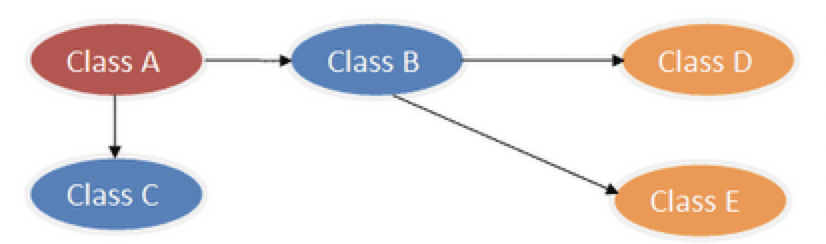
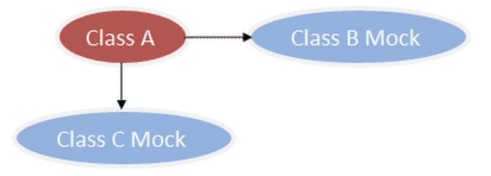

mockito是一个单测mock框架，上手简单，mockito官网：[http://mockito.org](http://mockito.org)，API文档：[http://docs.mockito.googlecode.com/hg/org/mockito/Mockito.html](http://docs.mockito.googlecode.com/hg/org/mockito/Mockito.html)，项目源码：[https://github.com/mockito/mockito](https://github.com/mockito/mockito)。 

## mockito基础 

在写单元测试的过程中，我们往往会遇到要测试的类有很多依赖，这些依赖的类/对象/资源又有别的依赖，从而形成一个大的依赖树，要在单元测试的环境中完整地构建这样的依赖，是一件很困难的事情。因此需要mock数据隔离各种依赖，方便单测独立的代码逻辑。比如：



为了测试class A，需要隔离class C和class B，因此需要mock B和C，如下：

 

**mock与stub**： 

stub也就是常说的打桩，针对某些入参返回自定义数据；mock也就是mock类，默认返回空数据（一般是null）。 

**常见的几个mockito注解**： 

```java
@Spy 
com.youzan.trade.core.service.query.OrderQueryService$MockitoMock$10456154 -- 为null时默认注入mock对象 
com.youzan.trade.core.service.query.OrderQueryService$$EnhancerByCGLIB$$ab5d0f7d -- 非null时注入实际对象 

@Mock 
com.youzan.trade.core.service.query.OrderQueryService$MockitoMock$1251285143 -- （不管是否为null都）注入mock对象 

@InjectMocks 
InjectMocks创建这个类的对象并自动将标记@Mock、@Spy等注解的属性值注入到这个中 
```


**使用示例**： 

```java 
import org.junit.Test;
import org.junit.runner.RunWith;
import org.mockito.InjectMocks;
import org.mockito.Mock;
import org.mockito.Mockito;
import org.mockito.Spy;
import org.mockito.junit.MockitoJUnitRunner;

import javax.annotation.Resource;

/**
 * @author luoxiangnan
 * @date 2019-10-17
 */
@RunWith(MockitoJUnitRunner.class)
public class MockitoMain {

    public static interface DubboRemoteFacade {
        String world(String param);
    }

    public static interface DubboLocalFacade {
        String hello(String param);
    }

    public static class DubboLocalFacadeImpl implements DubboLocalFacade {
        @Resource
        private DubboRemoteFacade dubboRemoteFacade;

        @Override
        public String hello(String param) {
            return dubboRemoteFacade.world(param);
        }
    }

    @InjectMocks
    private DubboLocalFacadeImpl dubboLocalFacade;

    // @Spy方式一
//    @Spy
//    private DubboRemoteFacade dubboRemoteFacade;
    // @Spy方式二
//    @Spy
//    private DubboRemoteFacade dubboRemoteFacade = new DubboRemoteFacade() {
//        @Override
//        public String world(String param) {
//            return "default";
//        }
//    };
    @Mock
    private DubboRemoteFacade dubboRemoteFacade;

    @Test
    public void test() {
        Mockito.when(dubboRemoteFacade.world("aaa")).thenReturn("111");
        Mockito.when(dubboRemoteFacade.world("bbb")).thenReturn("222");

        /**
         * @Spy方式一   111   null
         * @Spy方式二   111   null
         * @Mock方式   111   null
         */
        System.out.println(dubboLocalFacade.hello("aaa"));
        System.out.println(dubboLocalFacade.hello("fasd")); // null
    }
}
```

Mockito主要就是通过Stub打桩，通过方法名加参数来准确的定位测试桩然后返回预期的值。看到上面代码中的 `Mockito.when(dubboRemoteFacade.world("aaa")).thenReturn("111") `，不知道小伙伴有没有这样的疑问？ 

> Mockito.when消费的是方法的返回值，对方发内部并不感知，那么它是如何来准确通过方法名+参数的条件来打桩的。 

其实，Mock本质上是一个Proxy代理模式的应用。如果`Mockito.when`传入的是一个普通对象的方法，那么只消费方法返回值是无法完成对该方法打桩的。所以Mockito本质上就是在代理对象调用方法前，用stub的方式设置其返回值，然后在真实调用时，用代理对象返回起预设的返回值。 

再分析mockito原理之前，我们先看下mockito用于创建代理类（生成字节码）的工具---`bytebuddy`，了解下bytebuddy之后对于下面分析mockito原理会很有帮助。 

## bytebuddy 

Byte Buddy是致力于解决字节码操作和 instrumentation API 的复杂性的开源框架。Byte Buddy 所声称的目标是将显式的字节码操作隐藏在一个类型安全的领域特定语言背后。通过使用 Byte Buddy，任何熟悉 Java 编程语言的人都有望非常容易地进行字节码操作。 

Byte Buddy是一个较高层级的抽象的字节码操作工具，相较于ASM而言。其实吧，Byte Buddy 本身也是基于 ASM API 实现的。更多资料请参考：[https://www.infoq.cn/article/Easily-Create-Java-Agents-with-ByteBuddy](https://www.infoq.cn/article/Easily-Create-Java-Agents-with-ByteBuddy) 

如下的示例展现了如何生成一个简单的类，这个类是 Object 的子类，并且重写了 toString 方法，用来返回“Hello World!”。与原始的 ASM 类似，“intercept”会告诉 Byte Buddy 为拦截到的指令提供方法实现： 

```java
Class<?> dynamicType = new ByteBuddy()
        .subclass(Object.class)
        .method(ElementMatchers.named("toString"))
        .intercept(FixedValue.value("Hello World!"))
        .make()
        .load(Object.class.getClassLoader(), ClassLoadingStrategy.Default.WRAPPER)
        .getLoaded();
        
System.out.println(dynamicType.getSimpleName());
// 输出：Object$ByteBuddy$cmpHDO82
```


比如我们想看下上述示例中生成的动态类到底长什么样子，可以调用方法 `net.bytebuddy.dynamic.DynamicType#saveIn` 来将生成的class保存成class文件（可在debug时再watcher中调用saveIn方法），然后在IDEA中进行查看，如下所示： 

```java
//
// Source code recreated from a .class file by IntelliJ IDEA
// (powered by Fernflower decompiler)
//

package net.bytebuddy.renamed.java.lang;

public class Object$ByteBuddy$cmpHDO82 {
    public String toString() {
        return "Hello World!";
    }

    public Object$ByteBuddy$cmpHDO82() {
    }
}
```


## mockito原理 

关于mockito原理的分析，主要分析下Mockito.mock流程和Mockito.when流程，测试代码如下（为了方便调试，使用Mockito.mock而不是注解方式生成Mock代理类）： 

```java
@RunWith(MockitoJUnitRunner.class)
public class MockitoMain {

    public static interface DubboRemoteFacade {
        String world(String param);
    }

    @Test
    public void test() {
        DubboRemoteFacade remoteFacade = Mockito.mock(DubboRemoteFacade.class);

        Mockito.when(remoteFacade.world("aaa")).thenReturn("111");
        Mockito.when(remoteFacade.world("bbb")).thenReturn("222");

        System.out.println(remoteFacade.world("aaa")); // 111
        System.out.println(remoteFacade.world("ccc")); // null
    }
}
```

调用Mockito.mock生成mock代理类，首先是生成对应代理类class，如果多次调用Mockito.mock生成同样的mock代理类，肯定不会多次生成对应代理类class，而是在第一次生成之后保存到cache中，后续直接获取即可，对应代码如下： 

```java
// net.bytebuddy.TypeCache#findOrInsert
public Class<?> findOrInsert(ClassLoader classLoader, T key, Callable<Class<?>> lazy) {
    Class<?> type = find(classLoader, key);
    if (type != null) {
        // 已缓存直接返回
        return type;
    } else {
        return insert(classLoader, key, lazy.call());
    }
}
// org.mockito.internal.creation.bytebuddy.TypeCachingBytecodeGenerator#mockClass
public <T> Class<T> mockClass(final MockFeatures<T> params) {
    try {
        ClassLoader classLoader = params.mockedType.getClassLoader();
        return (Class<T>) typeCache.findOrInsert(classLoader,
                new MockitoMockKey(params.mockedType, params.interfaces, params.serializableMode, params.stripAnnotations),
                new Callable<Class<?>>() {
                    @Override
                    public Class<?> call() throws Exception {
                        // 动态生成代理类class
                        return bytecodeGenerator.mockClass(params);
                    }
                }, BOOTSTRAP_LOCK);
    } catch (IllegalArgumentException exception) {
        //
    }
}
```


动态生成代理类class对应方法： 

`org.mockito.internal.creation.bytebuddy.BytecodeGenerator#mockClass`，如下： 

```java
public <T> Class<? extends T> mockClass(MockFeatures<T> features) {
    String name = nameFor(features.mockedType);
    DynamicType.Builder<T> builder =
            byteBuddy.subclass(features.mockedType)
                     .name(name)
                     .ignoreAlso(isGroovyMethod())
                     .annotateType(features.stripAnnotations
                         ? new Annotation[0]
                         : features.mockedType.getAnnotations())
                    // 方法处理器 DispatcherDefaultingToRealMethod
                     .implement(new ArrayList<Type>(features.interfaces))
                     .method(matcher)
                       .intercept(to(DispatcherDefaultingToRealMethod.class))
                       .transform(withModifiers(SynchronizationState.PLAIN))
                       .attribute(features.stripAnnotations
                           ? MethodAttributeAppender.NoOp.INSTANCE
                           : INCLUDING_RECEIVER)
                     .method(isHashCode())
                       .intercept(to(MockMethodInterceptor.ForHashCode.class))
                     .method(isEquals())
                       .intercept(to(MockMethodInterceptor.ForEquals.class))
                     .serialVersionUid(42L)
                     .defineField("mockitoInterceptor", MockMethodInterceptor.class, PRIVATE)
                     .implement(MockAccess.class)
                       .intercept(FieldAccessor.ofBeanProperty());
    if (features.serializableMode == SerializableMode.ACROSS_CLASSLOADERS) {
        builder = builder.implement(CrossClassLoaderSerializableMock.class)
                         .intercept(to(MockMethodInterceptor.ForWriteReplace.class));
    }
    if (readReplace != null) {
        builder = builder.defineMethod("readObject", void.class, Visibility.PRIVATE)
                .withParameters(ObjectInputStream.class)
                .throwing(ClassNotFoundException.class, IOException.class)
                .intercept(readReplace);
    }
    ClassLoader classLoader = new MultipleParentClassLoader.Builder()
        .append(features.mockedType)
        .append(features.interfaces)
        .append(currentThread().getContextClassLoader())
        .append(MockAccess.class, DispatcherDefaultingToRealMethod.class)
        .append(MockMethodInterceptor.class,
            MockMethodInterceptor.ForHashCode.class,
            MockMethodInterceptor.ForEquals.class).build(MockMethodInterceptor.class.getClassLoader());
    if (classLoader != features.mockedType.getClassLoader()) {
        assertVisibility(features.mockedType);
        for (Class<?> iFace : features.interfaces) {
            assertVisibility(iFace);
        }
        builder = builder.ignoreAlso(isPackagePrivate()
            .or(returns(isPackagePrivate()))
            .or(hasParameters(whereAny(hasType(isPackagePrivate())))));
    }
    return builder.make()
                  .load(classLoader, loader.resolveStrategy(features.mockedType, classLoader, name.startsWith(CODEGEN_PACKAGE)))
                  .getLoaded();
}
```


上述方法虽然逻辑挺复杂的，但是实质上和bytebuddy示例代码原理是一样的，这里指定了方法处理器 `DispatcherDefaultingToRealMethod`，为了查看这里bytebuddy生成的动态class到底长什么样，再debug时手动执行saveIn方法将动态class保存成class文件，如下图： 


class文件内容如下： 

```java
//
// Source code recreated from a .class file by IntelliJ IDEA
// (powered by Fernflower decompiler)
//
package com.xxx;

import com.youzan.owl.trade.core.biz.api.trade.MockitoMain.DubboRemoteFacade;
import org.mockito.internal.creation.bytebuddy.MockAccess;
import org.mockito.internal.creation.bytebuddy.MockMethodInterceptor;
import org.mockito.internal.creation.bytebuddy.MockMethodInterceptor.DispatcherDefaultingToRealMethod;
import org.mockito.internal.creation.bytebuddy.MockMethodInterceptor.ForEquals;
import org.mockito.internal.creation.bytebuddy.MockMethodInterceptor.ForHashCode;

public class MockitoMain$DubboRemoteFacade$MockitoMock$294263869 implements DubboRemoteFacade, MockAccess {
    private static final long serialVersionUID = 42L;
    private MockMethodInterceptor mockitoInterceptor;

    public boolean equals(Object var1) {
        return ForEquals.doIdentityEquals(this, var1);
    }

    public String toString() {
        return (String)DispatcherDefaultingToRealMethod.interceptSuperCallable(this, this.mockitoInterceptor, cachedValue$f4wbfO7z$4cscpe1, new Object[0], new MockitoMain$DubboRemoteFacade$MockitoMock$294263869$auxiliary$ZDMmVEQX(this));
    }

    public int hashCode() {
        return ForHashCode.doIdentityHashCode(this);
    }

    protected Object clone() throws CloneNotSupportedException {
        return DispatcherDefaultingToRealMethod.interceptSuperCallable(this, this.mockitoInterceptor, cachedValue$f4wbfO7z$7m9oaq0, new Object[0], new MockitoMain$DubboRemoteFacade$MockitoMock$294263869$auxiliary$3zC3uoDC(this));
    }

    public String world(String param) {
        return (String)DispatcherDefaultingToRealMethod.interceptAbstract(this, this.mockitoInterceptor, (Object)null, cachedValue$f4wbfO7z$e78iil2, new Object[]{var1});
    }

    public void setMockitoInterceptor(MockMethodInterceptor var1) {
        this.mockitoInterceptor = var1;
    }

    public MockMethodInterceptor getMockitoInterceptor() {
        return this.mockitoInterceptor;
    }

    public MockitoMain$DubboRemoteFacade$MockitoMock$294263869() {
    }
}
```


到这里为止，一个mockito的动态代理类就创建OK了，我们也看到了代理类的方法处理器为`DispatcherDefaultingToRealMethod`；下面开始分析下Mockito.when流程，由于代理类的方法处理器为`DispatcherDefaultingToRealMethod`，所以以下示例代码的分析也需要从类`DispatcherDefaultingToRealMethod`开始： 

```java
// org.mockito.internal.creation.bytebuddy.MockMethodInterceptor.DispatcherDefaultingToRealMethod#interceptAbstract
public static Object interceptAbstract(@This Object mock, // 当前代理类
                                       @FieldValue("mockitoInterceptor") MockMethodInterceptor interceptor, // 方法拦截器
                                       @StubValue Object stubValue, // stub值，这里为null
                                       @Origin Method invokedMethod, // 当前调用方法
                                       @AllArguments Object[] arguments) /* 方法入参 */ throws Throwable {
    if (interceptor == null) {
        return stubValue;
    }
    return interceptor.doIntercept(
            mock,
            invokedMethod,
            arguments,
            RealMethod.IsIllegal.INSTANCE
    );
}
```


从方法interceptAbstract的入参可看出，当前方法调用的上下文信息基本都有了，基于这些信息会创建一个`InterceptedInvocation对象`，来表示一次方法调用，代码如下： 

```java
public static InterceptedInvocation createInvocation(Object mock, Method invokedMethod, Object[] arguments, RealMethod realMethod, MockCreationSettings settings, Location location) {
    return new InterceptedInvocation(
        new MockWeakReference<Object>(mock),
        createMockitoMethod(invokedMethod, settings),
        arguments,
        realMethod,
        location,
        SequenceNumber.next() // 每个InterceptedInvocation对象都有一个唯一序号
    );
}
```


方法调用时首先根据`InterceptedInvocation`对象查找对应的`stub（StubbedInvocationMatcher）`，如果找到则使用该stub返回特定值，否则返回默认值（一般为null）。 

```java
// org.mockito.internal.handler.MockHandlerImpl#handle
public Object handle(Invocation invocation) throws Throwable {
    if (invocationContainer.hasAnswersForStubbing()) {
        // stubbing voids with doThrow() or doAnswer() style
        InvocationMatcher invocationMatcher = matchersBinder.bindMatchers(
                mockingProgress().getArgumentMatcherStorage(),
                invocation
        );
        invocationContainer.setMethodForStubbing(invocationMatcher);
        return null;
    }
    VerificationMode verificationMode = mockingProgress().pullVerificationMode();

    InvocationMatcher invocationMatcher = matchersBinder.bindMatchers(
            mockingProgress().getArgumentMatcherStorage(),
            invocation
    );

    // 校验当前mockito当前处理状态，比如执行了两次 Mockito.when()，由于第一次Mockito.when()没有调用thenReturn
    // 所以第二次会报异常，就是这里判断的，MockitoProgress中有一个字段stubbingInProgress记录当前正在处理的Mockito代码信息
    // 对应类LocationImpl
    mockingProgress().validateState();

    // 校验，比如timers/nerver/atLeast校验等
    if (verificationMode != null) {
        // We need to check if verification was started on the correct mock
        // - see VerifyingWithAnExtraCallToADifferentMockTest (bug 138)
        if (((MockAwareVerificationMode) verificationMode).getMock() == invocation.getMock()) {
            VerificationDataImpl data = createVerificationData(invocationContainer, invocationMatcher);
            verificationMode.verify(data);
            return null;
        } else {
            // this means there is an invocation on a different mock. Re-adding verification mode
            // - see VerifyingWithAnExtraCallToADifferentMockTest (bug 138)
            mockingProgress().verificationStarted(verificationMode);
        }
    }

    // prepare invocation for stubbing
    // 打桩准备，保存当前invocation信息，ongoingStubbing保存到ThreadLocal中
    invocationContainer.setInvocationForPotentialStubbing(invocationMatcher);
    OngoingStubbingImpl<T> ongoingStubbing = new OngoingStubbingImpl<T>(invocationContainer);
    mockingProgress().reportOngoingStubbing(ongoingStubbing);

    // look for existing answer for this invocation
    // 根据invocation匹配对应的stub，匹配规则是 class相同+方法签名相同+入参匹配
    StubbedInvocationMatcher stubbing = invocationContainer.findAnswerFor(invocation);
    notifyStubbedAnswerLookup(invocation, stubbing);

    // 返回默认值或者返回自定义返回值
    if (stubbing != null) {
        stubbing.captureArgumentsFrom(invocation);
        return stubbing.answer(invocation);
    } else {
        Object ret = mockSettings.getDefaultAnswer().answer(invocation);
        DefaultAnswerValidator.validateReturnValueFor(invocation, ret);

        //Mockito uses it to redo setting invocation for potential stubbing in case of partial mocks / spies.
        //Without it, the real method inside 'when' might have delegated to other self method
        //and overwrite the intended stubbed method with a different one.
        //This means we would be stubbing a wrong method.
        //Typically this would led to runtime exception that validates return type with stubbed method signature.
        invocationContainer.resetInvocationForPotentialStubbing(invocationMatcher);
        return ret;
    }
}
```


第一次进行方法调用时 `invocationContainer.findAnswerFor` 返回为null，当执行了Mockito.when并添加了自定义返回值之后，再次执行方法调用， `invocationContainer.findAnswerFor` 返回就是非null，然后由stub返回自定义值。 

到这里为止，我们了解了方法的调用流程，但是还没有看到 StubbedInvocationMatcher 是什么时候添加到Mockito中的，这就是thenReturn内的逻辑了（`OngoingStubbing<String> o1 = Mockito.when(remoteFacade.world("aaa")).thenReturn("111")`，注意thenReturn和thenAnswer底层逻辑是一样的），代码如下： 

```java
public OngoingStubbing<T> thenReturn(T value) {
    return thenAnswer(new Returns(value));
}
public OngoingStubbing<T> thenAnswer(Answer<?> answer) {
    invocationContainer.addAnswer(answer);
    return new ConsecutiveStubbing<T>(invocationContainer);
}
public void addAnswer(Answer answer) {
     // 移除最近一次方法调用保存的invocation信息
    registeredInvocations.removeLast();
    // 
    addAnswer(answer, false);
}
public StubbedInvocationMatcher addAnswer(Answer answer, boolean isConsecutive) {
    Invocation invocation = invocationForStubbing.getInvocation();
    mockingProgress().stubbingCompleted();
    if (answer instanceof ValidableAnswer) {
        ((ValidableAnswer) answer).validateFor(invocation);
    }

    synchronized (stubbed) {
        if (isConsecutive) {
            // 连续方式
            stubbed.getFirst().addAnswer(answer);
        } else {
            // 非连续
            stubbed.addFirst(new StubbedInvocationMatcher(invocationForStubbing, answer));
        }
        return stubbed.getFirst();
    }
}
```


将打桩的自定义返回值添加到stubbed中之后，就可以在方法调用中根据方法+入参从stubbed中匹配自定义的返回值。这里有一个连续方式和非连续方式，是什么意思呢，连续方式就是说，针对同一个方法的多次调用，可以按照顺序自定义不同的返回值，如果调用次数超过了自定义返回值个数，默认后续以最后一个自定义返回值为准，示例代码如下： 

```java
DubboRemoteFacade remoteFacade = Mockito.mock(DubboRemoteFacade.class);
Mockito.when(remoteFacade.world("aaa")).thenReturn("111").thenReturn("222"); // 连续方式

System.out.println(remoteFacade.world("aaa")); // 111
System.out.println(remoteFacade.world("aaa")); // 222
//System.out.println(remoteFacade.world("aaa")); // 222，如果再调用一次的话
```


到这里为止mockito的原理大致就分析完了，最后稍微总结下： 

mockito是一个基于bytebuddy生成mock类（也就是代理类）的框架，常用于单测中。针对stub（打桩）原理，是借助于在执行方法调用时保存当前方法调用上下文到某个字段（`org.mockito.internal.stubbing.InvocationContainerImpl#invocationForStubbing字段`），然后将打桩信息+对应的函数调用上下文信息保存到stub有序列表中，后续执行方法调用会从stub列表中匹配对应的桩信息并返回，如果没有则返回默认值，通常是null。 

> 注意：目前mockito针对类的注入还仅限于往@InjectMocks修饰的类中注入，而不能往@Spy注入，如果能支持往@Spy类中注入，则在多层次类关系的测试场景中会很方便，当然由于mockito目前只专注于类隔离模式下的mock测试，不支持支持往@Spy类中注入也是说得过去的。 