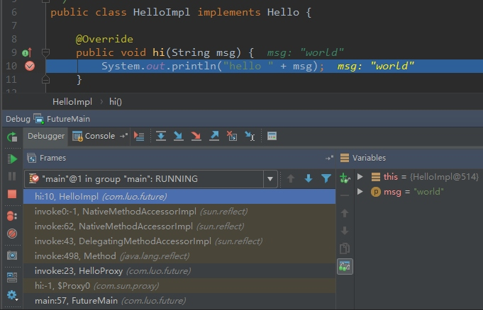

如果一个面试官问你：谈谈 Java 反射机制，动态代理是基于什么原理？

这个题目给我的第一印象是稍微有点诱导的嫌疑，可能会下意识地以为动态代理就是利用反射机制实现的，这么说也不算错但稍微有些不全面。功能才是目的，实现的方法有很多。

总的来说，这道题目考察的是 Java 语言的另外一种基础机制： **反射，它就像是一种魔法，引入运行时自省能力，赋予了 Java 语言令人意外的活力，通过运行时操作元数据或对象，Java 可以灵活地操作运行时才能确定的信息。而动态代理，则是延伸出来的一种广泛应用于产品开发中的技术，很多繁琐的重复编程，都可以被动态代理机制优雅地解决。**

1、反射

说到反射，首先要了解什么是Class。每个类都会产生一个对应的Class对象，一般保存在.class文件中。所有类都是在对其第一次使用时，动态加载到JVM的，当程序创建一个对类的静态成员的引用时，就会加载这个类。Class对象仅在需要的时候才会加载，static初始化是在类加载时进行的。类加载时，类加载器首先会检查这个类的Class对象是否已被加载过，如果尚未加载，默认的类加载器就会根据类名查找对应的.class文件。

## 1.1 class文件

任何一个Class文件都对应着唯一一个类或接口的信息(这里的类包括抽象类哈)，但反过来，类或接口信息并不一定都定义在文件里（比如类或接口可通过类加载器动态生成，Spring中AOP的实现中就有可能由类加载器动态生成代理类）。Class文件是一组以8字节为基础单位的二进制文件，各个数据项严格按照顺序紧凑着排列，中间没有任何分隔符，也就是说整个Class文件存储的几乎都是程序运行所需的必要数据。

想在运行时使用类型信息，必须获取对象(比如类Base对象)的Class对象的引用，使用Class.forName(“Base”)可以实现该目的，或者使用base.class。注意，有一点很有趣，使用”.class”来创建Class对象的引用时，不会自动初始化该Class对象，使用forName()会自动初始化该Class对象。使用”.class”不会自动初始化是因为被延迟到了对静态方法（构造器隐私地是静态的）或者非常数静态域进行首次引用时才进行。

为了使用类而做的准备工作一般有以下3个步骤：
- 加载：由类加载器完成，找到对应的字节码，创建一个Class对象
- 链接：验证类中的字节码，为静态域分配空间
- 初始化：如果该类有超类，则对其初始化，执行静态初始化器和静态初始化块

### 1.1 java反射

反射的概念是由Smith在1982年首次提出的，主要是指程序可以访问、检测和修改它本身状态或行为的一种能力。有了反射，使Java相对于C、C++等语言就有了很强大的操作对象属性及其方法的能力，注意，反射与直接调用对象方法和属性相比，性能有一定的损耗，但是如果不是用在对性能有很强的场景下，反射都是一个很好且灵活的选择。

**使用示例（获取对象所有属性值）：**
```Java
public class Person {
    private String name;
    private int age;
    // ...
}
 
Person person = new Person();
person.setName("luo");
person.setAge(25);
 
try {
    Class clazz = person.getClass();
    Field[] fields = clazz.getDeclaredFields();
    for (Field field : fields) {
        field.setAccessible(true);
        System.out.println(field.getType() + " | " +
                field.getName() + " = " +
                field.get(person));
    }
 
    // 通过反射获取某一个方法
    Method method = clazz.getMethod("setName", String.class);
    method.invoke(person, "bei");
 
    System.out.println(person);
} catch (Exception e) {
    e.printStackTrace();
}
```

### 1.3 反射原理

平常的项目开发基本很少与反射打交道，因为框架已经帮我们做了很多的事情了。但这不能说明反射机制没有用，实际上有很多设计、开发都与反射机制有关，例如模块化的开发，通过反射去调用对应的字节码；动态代理设计模式也采用了反射机制，还有我们日常使用的 Spring／Hibernate 等框架，也是利用CGLIB 反射机制才得以实现。

反射技术在在框架和中间件技术应用较多，有一句老话就是反射是Java框架的基石。典型的使用就是Spring的IoC实现，不管对象谁管理创建，只要我能用就行。再比如RPC技术可以借助于反射来实现，本地主机将要远程调用的对象方法等信息发送给远程主机，这些信息包括class名、方法名、方法参数类型、方法入参等，远程主机接收到这些信息后就可以借助反射来获取并执行对象方法，然后将结果返回即可。

说了那么多，那么Java反射是如何实现的呢？**简单来说Java反射就是靠JVM和Class相关类来实现的，Class相关类包括Field、Method和Constructor类等**。

类加载器加载完成一个类之后，会生成类对应的**Class对象、Field对象、Method对象、Constructor对象**，这些对象都保存在JVM（方法区）中，这也说明了反射必须在加载类之后进行的原因。使用反射时，其实就是与上述所说的这几个对象打交道呀（貌似Java反射也就这么一回事哈）。

既然了解了Java反射原理，可以试想一下C++为什么没有反射呢，想让C++拥有反射该如何做呢？Java相对于C++实现反射最重要的差别就是Java可以依靠JVM这一悍将，可以由JVM保存对象的相关信息，然后应用程序使用时直接从JVM中获取使用。但是C++编译后直接变成了机器码了，貌似类或者对象的啥信息都没了。。。 其实想让C++拥有反射能力，就需要保存能够操作类方法、类构造方法、类属性的这些信息，这些信息要么由应用程序自己来做，要么由第三方工具来保存，然后应用程序使用从它那里获取，这些信息可以通过（函数）指针来记录，使用时通过指针来调用。

## 2、动态代理

代理模式是为了提供额外或不同的操作，而插入的用来替代”实际”对象的对象，这些操作涉及到与”实际”对象的通信，因此代理通常充当中间人角色。Java的动态代理比代理的思想更前进了一步，它可以动态地创建并代理并动态地处理对所代理方法的调用。在动态代理上所做的所有调用都会被重定向到单一的调用处理器上，它的工作是揭示调用的类型并确定相应的策略。

以下是一个动态代理示例：
```Java
public interface Hello {
    void hi(String msg);
}
public class HelloImpl implements Hello {
    @Override
    public void hi(String msg) {
        System.out.println("hello " + msg);
    }
}
 
/**
 * 代理类
 */
@Data
@NoArgsConstructor
@AllArgsConstructor
public class HelloProxy implements InvocationHandler {
    private Object proxied = null;
 
    @Override
    public Object invoke(Object proxy, Method method, Object[] args) throws Throwable {
        System.out.println("hello proxy");
        System.out.println(proxied.getClass().getName());
        System.out.println(proxy.getClass().getName());
        return method.invoke(proxied, args);
    }
}
 
public static void main(String[] args) {
    Hello hello = (Hello) Proxy.newProxyInstance(Hello.class.getClassLoader(), new Class[]{Hello.class}, new HelloProxy(new HelloImpl()));
 
    hello.hi("world");
}
```

通过调用Proxy静态方法Proxy.newProxyInstance()可以创建动态代理，这个方法需要得到一个类加载器，一个你希望该代理实现的接口列表(不是类或抽象类)，以及InvocationHandler的一个实现类。动态代理可以将所有调用重定向到调用处理器，因此通常会调用处理器的构造器传递一个”实际”对象的引用，从而将调用处理器在执行中介任务时，将请求转发。

### 2.1 动态代理与反射的关系

动态代理底层是基于反射来实现的，这么说也不算错但稍微有些不全面。以上述代码为例，首先是写一个InvocationHandler实现类并调用Proxy.newProxyInstance生成代理类，然后在InvocationHandler实现类中通过反射调用对应的代理方法。

最后看下上述代码的调用栈信息：



**参考资料：**

1、[BAT等公司必问的8道Java经典面试题，你都会了吗？](https://zhuanlan.zhihu.com/p/38131658)
2、[深入理解Java反射](http://jiangli19192.iteye.com/blog/1976827)
