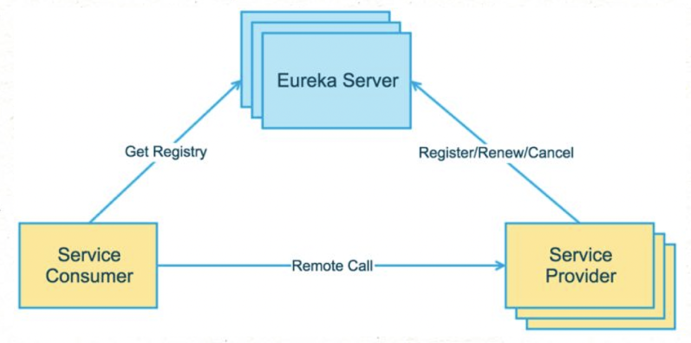

Eureka是Netflix开源的一款提供服务注册和发现的产品，github地址为 https://github.com/Netflix/eureka。注册中心是分布式开发的核心组件之一，而eureka是spring cloud推荐的注册中心实现，因此对于Java开发同学来说，还是有必要学习eureka的，特别是其架构及设计思想。

> 官方文档定义是：Eureka is a REST (Representational State Transfer) based service that is primarily used in the AWS cloud for locating services for the purpose of load balancing and failover of middle-tier servers. We call this service, the Eureka Server. Eureka also comes with a Java-based client component,the Eureka Client, which makes interactions with the service much easier. The client also has a built-in load balancer that does basic round-robin load balancing.

> Eureka是一个REST (Representational State Transfer)服务，它主要用于AWS云，用于定位服务，以实现中间层服务器的负载平衡和故障转移，我们称此服务为Eureka服务器。Eureka也有一个基于java的客户端组件，Eureka客户端，这使得与服务的交互更加容易，同时客户端也有一个内置的负载平衡器，它执行基本的循环负载均衡。


Eureka提供了完整的Service Registry和Service Discovery实现，并且也经受住了Netflix自己的生产环境考验，相对使用起来会比较省心*（同时Spring Cloud还有一套非常完善的开源代码来整合Eureka，所以使用起来非常方便）*。


本文主要内容有：eureka基础概念及架构、服务发现原理、eureka server/client流程分析及优缺点分析，最后做个小结。由于本文侧重于原理分析，因此eureka（结合spring cloud）的使用就不再赘述了，感兴趣的小伙伴可以看下 [程序猿DD]( http://www.didispace.com/) 关于spring cloud的相关教程。


## eureka基础

### eureka架构图



- **Eureka Server**：提供服务注册和发现，多个Eureka Server之间会同步数据，做到状态一致（最终一致性）
- **Service Provider**：服务提供方，将自身服务注册到Eureka，从而使服务消费方能够找到
- **Service Consumer**：服务消费方，从Eureka获取注册服务列表，从而能够消费服务

注意，上图中的3个角色都是逻辑角色，在实际运行中，这几个角色甚至可以是同一个项目（JVM进程）中。


### 自我保护机制

自我保护机制主要在Eureka Client和Eureka Server之间存在网络分区的情况下发挥保护作用，在服务器端和客户端都有对应实现。假设在某种特定的情况下（如网络故障）, Eureka Client和Eureka Server无法进行通信，此时Eureka Client无法向Eureka Server发起注册和续约请求，Eureka Server中就可能因注册表中的服务实例租约出现大量过期而面临被剔除的危险，然而此时的Eureka Client可能是处于健康状态的（可接受服务访问），如果直接将注册表中大量过期的服务实例租约剔除显然是不合理的，自我保护机制提高了eureka的服务可用性。

> 当自我保护机制触发时，Eureka不再从注册列表中移除因为长时间没收到心跳而应该过期的服务，仍能查询服务信息并且接受新服务注册请求，也就是其他功能是正常的。这里思考下，如果eureka节点A触发自我保护机制过程中，有新服务注册了然后网络回复后，其他peer节点能收到A节点的新服务信息，数据同步到peer过程中是有网络异常重试的，也就是说，是能保证最终一致性的。


## 服务发现原理

eureka server可以集群部署，多个节点之间会进行（异步方式）数据同步，保证数据最终一致性，Eureka Server作为一个开箱即用的服务注册中心，提供的功能包括：服务注册、接收服务心跳、服务剔除、服务下线等。需要注意的是，Eureka Server同时也是一个Eureka Client，在不禁止Eureka Server的客户端行为时，它会向它配置文件中的其他Eureka Server进行拉取注册表、服务注册和发送心跳等操作。

eureka server端通过`appName`和`instanceInfoId`来唯一区分一个服务实例，服务实例信息是保存在哪里呢？其实就是一个Map中：

```java
// 第一层的key是appName，第二层的key是instanceInfoId
private final ConcurrentHashMap<String, Map<String, Lease<InstanceInfo>>> registry 
	= new ConcurrentHashMap<String, Map<String, Lease<InstanceInfo>>>();
```


### 服务注册

Service Provider启动时会将服务信息（InstanceInfo）发送给eureka server，eureka server接收到之后会写入registry中，服务注册默认过期时间`DEFAULT_DURATION_IN_SECS = 90`秒。InstanceInfo写入到本地registry之后，然后同步给其他peer节点，对应方法`com.netflix.eureka.registry.PeerAwareInstanceRegistryImpl#replicateToPeers`。


#### 写入本地registry

服务信息（InstanceInfo）保存在Lease中，写入本地registry对应方法`com.netflix.eureka.registry.PeerAwareInstanceRegistryImpl#register`，Lease统一保存在内存的`ConcurrentHashMap`中，在服务注册过程中，首先加个读锁，然后从registry中判断该Lease是否已存在，如果已存在则比较`lastDirtyTimestamp`时间戳，取二者最大的服务信息，避免发生数据覆盖。使用InstanceInfo创建一个新的InstanceInfo：

```java
if (existingLastDirtyTimestamp > registrationLastDirtyTimestamp) {
    // 已存在Lease则比较时间戳，取二者最大值
    registrant = existingLease.getHolder();
}
Lease<InstanceInfo> lease = new Lease<InstanceInfo>(registrant, leaseDuration);
if (existingLease != null) {
    // 已存在Lease则取上次up时间戳
    lease.setServiceUpTimestamp(existingLease.getServiceUpTimestamp());
}

public Lease(T r, int durationInSecs) {
    holder = r;
    registrationTimestamp = System.currentTimeMillis(); // 当前时间
    lastUpdateTimestamp = registrationTimestamp;
    duration = (durationInSecs * 1000);
}
```

不知道小伙伴看了上述方法的代码有没有这样的疑问？

> 通过读锁并且 `registry` 的读取和写入不是原子的，那么在并发时其实是有可能发生数据覆盖的，如果发生数据覆盖岂不是有问题了！猛一看会以为脏数据不就是有问题么？换个角度想，脏数据就一定有问题么？
>
> 其实针对这个问题，eureka的处理方式是没有问题的，该方法并发时，针对InstanceInfo Lease的构造，二者的信息是基本一致的，因为registrationTimestamp取的就是当前时间，所以并并发的数据不会产生问题。


#### 同步给其他peer

InstanceInfo写入到本地registry之后，然后同步给其他peer节点，对应方法`com.netflix.eureka.registry.PeerAwareInstanceRegistryImpl#replicateToPeers`。如果当前节点接收到的InstanceInfo本身就是另一个节点同步来的，则不会继续同步给其他节点，避免形成“广播效应”；InstanceInfo同步时会排除当前节点。

InstanceInfo的状态有依以下几种：`Heartbeat, Register, Cancel, StatusUpdate, DeleteStatusOverride`，默认情况下同步操作时批量异步执行的，同步请求首先缓存到Map中，key为`requestType+appName+id`，然后由发送线程将请求发送到peer节点。

> Peer之间的状态是采用异步的方式同步的，所以不保证节点间的状态一定是一致的，不过基本能保证最终状态是一致的。结合服务发现的场景，实际上也并不需要节点间的状态强一致。在一段时间内（比如30秒），节点A比节点B多一个服务实例或少一个服务实例，在业务上也是完全可以接受的（Service Consumer侧一般也会实现错误重试和负载均衡机制）。所以按照CAP理论，Eureka的选择就是放弃C，选择AP。
>
> 如果同步过程中，出现了异常怎么办呢，这时会根据异常信息做对应的处理，如果是读取超时或者网络连接异常，则稍后重试；如果其他异常则打印错误日志不再后续处理。


### 服务续约

Renew（服务续约）操作由Service Provider定期调用，类似于heartbeat。主要是用来告诉Eureka Server Service Provider还活着，避免服务被剔除掉。renew接口实现方式和register基本一致：首先更新自身状态，再同步到其它Peer，服务续约也就是把过期时间设置为当前时间加上duration的值。

> 注意：服务注册如果InstanceInfo不存在则加入，存在则更新；而服务预约只是进行更新，如果InstanceInfo不存在直接返回false。


### 服务下线

Cancel（服务下线）一般在Service Provider shutdown的时候调用，用来把自身的服务从Eureka Server中删除，以防客户端调用不存在的服务，eureka从本地”删除“（设置为删除状态）之后会同步给其他peer，对应方法`com.netflix.eureka.registry.PeerAwareInstanceRegistryImpl#cancel`。


### 服务失效剔除

Eureka Server中有一个EvictionTask，用于检查服务是否失效。Eviction（失效服务剔除）用来定期（默认为每60秒）在Eureka Server检测失效的服务，检测标准就是超过一定时间没有Renew的服务。默认失效时间为90秒，也就是如果有服务超过90秒没有向Eureka Server发起Renew请求的话，就会被当做失效服务剔除掉。失效时间可以通过`eureka.instance.leaseExpirationDurationInSeconds`进行配置，定期扫描时间可以通过`eureka.server.evictionIntervalTimerInMs`进行配置。

服务剔除#evict方法中有很多限制，都是为了保证Eureka Server的可用性：比如自我保护时期不能进行服务剔除操作、过期操作是分批进行、服务剔除是随机逐个剔除，剔除均匀分布在所有应用中，防止在同一时间内同一服务集群中的服务全部过期被剔除，以致大量剔除发生时，在未进行自我保护前促使了程序的崩溃。


## eureka server/client流程

### 服务信息拉取

Eureka consumer服务信息的拉取分为全量式拉取和增量式拉取，eureka consumer启动时进行全量拉取，运行过程中由定时任务进行增量式拉取，如果网络出现异常，可能导致先拉取的数据被旧数据覆盖（比如上一次拉取线程获取结果较慢，数据已更新情况下使用返回结果再次更新，导致数据版本落后），产生脏数据。对此，eureka通过类型AtomicLong的fetchRegistryGeneration对数据版本进行跟踪，版本不一致则表示此次拉取到的数据已过期。

> fetchRegistryGeneration过程是在拉取数据之前，执行`fetchRegistryGeneration.get`获取当前版本号，获取到数据之后，通过`fetchRegistryGeneration.compareAndSet`来判断当前版本号是否已更新。
>
> 注意：如果增量式更新出现意外，会再次进行一次全量拉取更新。


### Eureka server的伸缩容

Eureka Server是怎么知道有多少Peer的呢？Eureka Server在启动后会调用`EurekaClientConfig.getEurekaServerServiceUrls`来获取所有的Peer节点，并且会定期更新。定期更新频率可以通过`eureka.server.peerEurekaNodesUpdateIntervalMs`配置。

这个方法的默认实现是从配置文件读取，所以如果Eureka Server节点相对固定的话，可以通过在配置文件中配置来实现。如果希望能更灵活的控制Eureka Server节点，比如动态扩容/缩容，那么可以`override getEurekaServerServiceUrls`方法，提供自己的实现，比如我们的项目中会通过数据库读取Eureka Server列表。


> eureka server启动时把自己当做是Service Consumer从其它Peer Eureka获取所有服务的注册信息。然后对每个服务信息，在自己这里执行Register，isReplication=true，从而完成初始化。


### Service Provider

Service Provider启动时首先时注册到Eureka Service上，这样其他消费者才能进行服务调用，除了在启动时之外，只要实例状态信息有变化，也会注册到Eureka Service。需要注意的是，需要确保配置`eureka.client.registerWithEureka=true`。register逻辑在方法`AbstractJerseyEurekaHttpClient.register`中，Service Provider会依次注册到配置的Eureka Server Url上，如果注册出现异常，则会继续注册其他的url。

Renew操作会在Service Provider端定期发起，用来通知Eureka Server自己还活着。 这里`instance.leaseRenewalIntervalInSeconds`属性表示Renew频率。默认是30秒，也就是每30秒会向Eureka Server发起Renew操作。这部分逻辑在HeartbeatThread类中。在Service Provider服务shutdown的时候，需要及时通知Eureka Server把自己剔除，从而避免客户端调用已经下线的服务，逻辑本身比较简单，通过对方法标记@PreDestroy，从而在服务shutdown的时候会被触发。


### Service Consumer

Service Consumer这块的实现相对就简单一些，因为它只涉及到从Eureka Server获取服务列表和更新服务列表。Service Consumer在启动时会从Eureka Server获取所有服务列表，并在本地缓存。需要注意的是，需要确保配置`eureka.client.shouldFetchRegistry=true`。由于在本地有一份Service Registries缓存，所以需要定期更新，定期更新频率可以通过`eureka.client.registryFetchIntervalSeconds`配置。


## 小结

为什么要用eureka呢，因为分布式开发架构中，任何单点的服务都不能保证不会中断，因此需要服务发现机制，某个节点中断后，服务消费者能及时感知到保证服务高可用。从eureka的设计与实现上来说还是容易理解的，SpringCloud将它集成在自己的子项目spring-cloud-netflix中，实现SpringCloud的服务发现功能。

注册中心除了用eureka之外，还有zookeeper、consul、nacos等解决方案，他们实现原理不同，各自适用于不同的场景，可按需使用。


### Eureka比ZooKeeper相比优势是什么

**Zookeeper保证CP**
当向注册中心查询服务列表时，我们可以容忍注册中心返回的是几分钟以前的注册信息，但不能接受服务直接down掉不可用。也就是说，服务注册功能对可用性的要求要高于一致性。但是zk会出现这样一种情况，当master节点因为网络故障与其他节点失去联系时，剩余节点会重新进行leader选举。问题在于，选举leader的时间太长，30 ~ 120s, 且选举期间整个zk集群都是不可用的，这就导致在选举期间注册服务瘫痪。在云部署的环境下，因网络问题使得zk集群失去master节点是较大概率会发生的事，虽然服务能够最终恢复，但是漫长的选举时间导致的注册长期不可用是不能容忍的。


**Eureka保证AP**
Eureka看明白了这一点，因此在设计时就优先保证可用性。Eureka各个节点都是平等的，几个节点挂掉不会影响正常节点的工作，剩余的节点依然可以提供注册和查询服务。而Eureka的客户端在向某个Eureka注册或时如果发现连接失败，则会自动切换至其它节点，只要有一台Eureka还在，就能保证注册服务可用(保证可用性)，只不过查到的信息可能不是最新的(不保证强一致性)。除此之外，Eureka还有一种自我保护机制，如果在15分钟内超过85%的节点都没有正常的心跳，那么Eureka就认为客户端与注册中心出现了网络故障。


**eureka有哪些不足：**
eureka consumer本身有缓存，服务状态更新滞后，最常见的状况就是，服务下线了但是服务消费者还未及时感知，此时调用到已下线服务会导致请求失败，只能依靠consumer端的容错机制来保证。